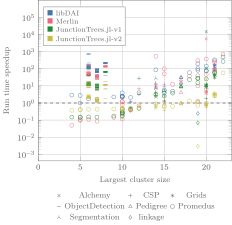

# Performance evaluation

The graph below illustrates a comparison of the runtime performance of
*TensorInference.jl* against *Merlin* [^marinescu2022merlin], *libDAI*
[^mooij2010libdai], and *JunctionTrees.jl* [^roa2022partial][^roa2023scaling]
libraries. Both *Merlin* and *libDAI* have previously participated in UAI
inference competitions [^gal2010summary][^gogate2014uai], achieving favorable
results. Additionally, we compared against two versions of *JunctionTrees.jl*,
the predecessor of *TensorInference.jl*. The first version does not employ
tensor technology, while the second version optimizes individual sum-product
computations using tensor-based technology. The experiments were conducted on
an Intel Core i9--9900K CPU @3.60GHz with 64 GB of RAM.

```@raw html

```

The benchmark problems are arranged along the x-axis in ascending order of
complexity, measured by the induced tree width. On average,
*TensorInference.jl* achieves a speedup of 11 times across all problems.
Notably, for the 10 most complex problems, the average speedup increases to 63
times, highlighting its superior scalability.

## References

[^marinescu2022merlin]:
    Radu Marinescu. Merlin. 2022. [Online]. Available: [https://www.ibm.com/opensource/open/projects/merlin/](https://www.ibm.com/opensource/open/projects/merlin/) [Accessed: 11 September 2023].

[^mooij2010libdai]:
    Joris M. Mooij. libDAI: A Free and Open Source C++ Library for Discrete Approximate Inference in Graphical Models. *Journal of Machine Learning Research*, 11:2169-2173, Aug 2010. [Online]. Available: [http://www.jmlr.org/papers/volume11/mooij10a/mooij10a.pdf](http://www.jmlr.org/papers/volume11/mooij10a/mooij10a.pdf).

[^gal2010summary]:
    Gal Elidan and Amir Globerson. Summary of the 2010 UAI approximate inference challenge. 2010. [Online]. Available: [https://www.cs.huji.ac.il/project/UAI10/summary.php](https://www.cs.huji.ac.il/project/UAI10/summary.php) [Accessed: 11 September 2023].

[^gogate2014uai]:
    Vibhav Gogate. UAI 2014 Probabilistic Inference Competition. 2014. [Online]. Available: [https://www.ics.uci.edu/~dechter/softwares/benchmarks/Uai14/UAI_2014_Inference_Competition.pdf](https://www.ics.uci.edu/~dechter/softwares/benchmarks/Uai14/UAI_2014_Inference_Competition.pdf) [Accessed: 11 September 2023].
