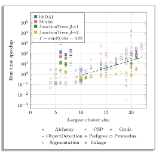

# Performance evaluation

The graph below illustrates a comparison of the runtime performance of
*TensorInference.jl* against *Merlin* [^marinescu2022merlin], *libDAI*
[^mooij2010libdai], and *JunctionTrees.jl* [^roa2022partial] libraries,
specifically for the task of computing the marginal probabilities of all
variables. Both *Merlin* and *libDAI* have previously participated in UAI
inference competitions [^gal2010summary][^gogate2014uai], achieving favorable
results. Additionally, we compared against *JunctionTrees.jl*, the predecessor
of *TensorInference.jl*. The experiments were conducted on an Intel Core
i9--9900K CPU @3.60GHz with 64 GB of RAM. Performance comparisons for other
tasks will be added in the near future.

```@raw html

```

The benchmark problems are arranged along the x-axis in ascending order of
complexity, measured by the induced tree width. On average,
*TensorInference.jl* achieves a speedup of 20 times across all problems.
Notably, for the 10 most complex problems, the average speedup increases to
148 times, highlighting its superior scalability. The graph features a fitted
linear curve in log-space to underscore the exponential improvement in
computation time achieved by *TensorInference.jl* in comparison to the other
alternatives. This speedup is primarily due to our package's unique approach:
while traditional solvers typically focus only on minimizing space complexity
(as quantified by the induced tree width), *TensorInference.jl* is
designed to optimize for both time and space complexity. 

## References

[^gal2010summary]:
    Gal Elidan and Amir Globerson. Summary of the 2010 UAI approximate inference challenge. 2010. [Online]. Available: [https://www.cs.huji.ac.il/project/UAI10/summary.php](https://www.cs.huji.ac.il/project/UAI10/summary.php) [Accessed: 11 September 2023].

[^gogate2014uai]:
    Vibhav Gogate. UAI 2014 Probabilistic Inference Competition. 2014. [Online]. Available: [https://www.ics.uci.edu/~dechter/softwares/benchmarks/Uai14/UAI_2014_Inference_Competition.pdf](https://www.ics.uci.edu/~dechter/softwares/benchmarks/Uai14/UAI_2014_Inference_Competition.pdf) [Accessed: 11 September 2023].

[^marinescu2022merlin]: 
    Radu Marinescu. Merlin. 2022. [Online]. Available: [https://www.ibm.com/opensource/open/projects/merlin/](https://www.ibm.com/opensource/open/projects/merlin/) [Accessed: 11 September 2023].

[^mooij2010libdai]:
    Joris M. Mooij. libDAI: A Free and Open Source C++ Library for Discrete Approximate Inference in Graphical Models. *Journal of Machine Learning Research*, 11:2169-2173, Aug 2010. [Online]. Available: [http://www.jmlr.org/papers/volume11/mooij10a/mooij10a.pdf](http://www.jmlr.org/papers/volume11/mooij10a/mooij10a.pdf).

[^roa2022partial]:
    Martin Roa-Villescas, Patrick W.A. Wijnings, Sander Stuijk, Henk Corporaal. "Partial Evaluation in Junction Trees". In: 2022 25th Euromicro Conference on Digital System Design (DSD), pp. 429-437, 2022. doi: [10.1109/DSD57027.2022.00064](https://doi.org/10.1109/DSD57027.2022.00064)
